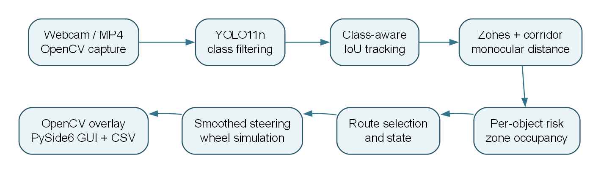
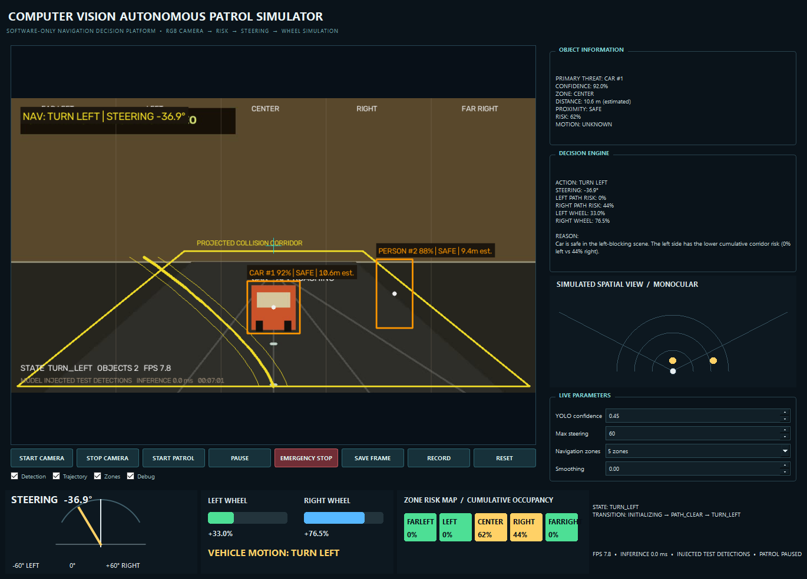

# Computer Vision Autonomous Patrol Simulator Project Proposal

**Prepared for:** Academic project review and presentation  
**Project area:** Computer vision and explainable navigation  
**Status:** Working software prototype with further validation proposed  
**Date:** 3 October 2026

## Proposal summary

This project proposes a desktop simulator that turns camera video into an understandable navigation recommendation. A YOLO object detector identifies selected obstacles; tracking and image geometry estimate where they are and whether they appear to approach; a risk model compares left and right routes; and a dashboard displays the resulting steering and wheel commands. The existing code already implements this pipeline and a PySide6 interface. The proposed next phase is to evaluate it on real footage, correct known control and visualization inconsistencies, and present its behavior with reproducible demonstrations.

The intended outcome is an educational platform for studying how perception errors and risk rules affect navigation decisions. It will remain a software simulation, with no connection to physical motors or claims of safe autonomous driving.

## Problem and motivation

A camera can detect objects, but a detection box alone does not explain what a mobile system should do. A useful computer vision demonstration must connect object position and apparent proximity to a clear decision: continue, turn toward a lower-risk route, or stop. It should also expose why that decision was made so it can be inspected and challenged.

This proposal addresses that gap with a visible, modular camera-to-decision pipeline. It is suitable for an academic demonstration because each stage can be examined independently, the parameters can be changed live, and a video file can replay the same scene for comparison. The main research question is: **How can monocular object detections be combined with simple scene geometry and explainable risk rules to produce stable simulated navigation decisions?**

## Aim and objectives

The aim is to build and evaluate an explainable computer vision navigation simulator using a single RGB camera or prerecorded video. The project has five objectives:

1. Detect relevant scene objects and assign stable identities across frames.
2. Estimate each object's image zone, projected-path membership, and approximate proximity.
3. Combine multiple object risks to choose a lower-risk lateral route or a stop.
4. Show the decision, reason, steering angle, and simulated wheel values in a live dashboard.
5. Evaluate repeatability, failure cases, and runtime performance using controlled scenarios and real video.

## Proposed solution

The application reads webcam or MP4 frames through OpenCV. An optional Ultralytics YOLO11n model produces object classes, confidence scores, and boxes for people, bicycles, vehicles, buses, trucks, and chairs. A class-aware intersection-over-union tracker assigns IDs and classifies apparent approach from changes in box area. Horizontal image zones and a projected center corridor describe where each object appears in the frame. A pinhole-style estimate uses assumed object height and box height to assign a rough distance band. A weighted risk score then combines proximity, size, vertical position, corridor membership, object type, confidence, and approach.

For each frame, the system keeps the highest risk in each zone and combines the left and right zone risks. If the scene risk is low, it recommends straight travel. If a lateral route is below the stop threshold, it turns toward the lower-risk side. If both sides exceed that threshold, it requests a stop. The resulting angle is smoothed and converted into two simulated wheel percentages. OpenCV draws boxes, zone lines, the projected corridor, and a trajectory over the video; PySide6 shows the frame beside the decision explanation and gauges.

The initial code and report are available in this repository. The architecture is modular, so camera capture, detection, risk rules, and interface widgets can be tested or replaced separately.

## Computer vision contribution

The central contribution is the **reasoning chain from image evidence to an explainable action**. Rather than treating an object class as a command, the system uses spatial and temporal cues. The following table states what each cue contributes and what it cannot establish on its own.

| Cue | Role in the decision | Key limitation |
|---|---|---|
| YOLO box and class | Locates a relevant object and supplies a confidence score. | An undetected object cannot enter the risk model. |
| Box-center zone | Assigns the object to left, center, or right regions. | A single point ignores a box spanning several zones. |
| Bounding-box height | Produces an approximate monocular distance using assumed class height. | Unknown size, pose, and camera calibration affect the estimate. |
| Box-area history | Suggests approach or retreat across tracked frames. | Camera movement and tracking errors can imitate approach. |
| Corridor membership | Raises risk for objects near the projected center path. | The current geometric test is simpler than the displayed trapezoid. |
| Zone risk aggregation | Captures multiple objects on one side. | The scores are heuristic and are not collision probabilities. |

This design makes the decision inspectable. A presenter can point to a bounding box, its estimated proximity and risk, the left/right risk totals, and the resulting command. The project also offers a clear basis for future comparison with calibrated depth, segmentation, or stronger tracking methods.

## Current prototype and proposed validation

The repository already contains the main pipeline, dashboard, YAML configuration, a synthetic MP4 generator, screenshot and recording controls, CSV logging, and six headless navigation tests. All six tests passed in the reviewed environment. The installed YOLO model loaded on CPU, but the simple synthetic video drawings yielded no detections at five sampled times. Therefore, the existing turn and stop dashboard figures use clearly labeled injected test detections to exercise the downstream logic; they are demonstrations of navigation behavior, not measured YOLO accuracy.

The next validation phase will use real footage containing configured object classes. It should record three kinds of evidence: whether selected objects are detected and tracked consistently; whether clear, left, right, and blocked scenes produce the intended navigation state; and how much time capture and inference take on the presentation computer. Cases with missed detections, occlusions, changing light, or camera movement should be included because they expose the system's practical limits. Findings will be reported as observations with the footage and settings identified, rather than as a general safety or accuracy claim.

**Figure:** Actual dashboard capture for a controlled left-turn scenario. The object boxes were injected over the synthetic demonstration video; the detection status in the image states this.

## Planned work and deliverables

| Phase | Work | Deliverable |
|---|---|---|
| 1  Baseline | Freeze the current configuration, review the pipeline, and prepare repeatable video scenes. | Architecture diagram, configuration record, and test cases. |
| 2  Real footage evaluation | Run the YOLO-enabled application on representative camera or video scenes and record detection and timing observations. | Annotated examples and a concise evaluation table. |
| 3  Consistency fixes | Align the visual corridor with the analysis geometry and make pause, emergency state, and requested-stop behavior explicit. | Updated code and focused regression tests. |
| 4  Presentation | Rehearse the clear, obstacle, turn, and blocked-route demonstrations; prepare figures and explain limitations. | Final report, runnable demo, and presentation slides. |

These phases describe the sequence of work; they are not claims that the evaluation or fixes are already complete. A feasible presentation package would include the source repository, setup instructions, the engineering report, the application demo, outcome captures, and a short record of real-footage tests.

## Expected results and success criteria

The expected result is a dashboard that can replay a video or use a webcam, show tracked detections when the model recognizes configured classes, and display why each simulated navigation command was chosen. The demonstration should include a clear scene with equal wheel values, a scene that chooses the lower-risk side, and a blocked scene that requests a stop with zero wheels after the applied action changes. The existing tests provide a baseline for these decisions; new evaluation should document real-footage observations and runtime behavior.

Success for this project means that the pipeline and its limits can be reproduced and explained. It does not mean the system can measure reliable physical distance, guarantee obstacle avoidance, or operate a real vehicle.

## Risks and constraints

The largest technical risk is monocular uncertainty: a box height depends on object size, pose, partial visibility, lens geometry, and detection quality. If YOLO misses an object or inference fails, the current pipeline may interpret the frame as clear. Tracking is based on greedy IoU matching, so ID swaps are possible in crowded scenes. Inference currently runs on the GUI timer callback, which can reduce responsiveness on slower hardware. The present action hold can also delay a requested stop, and the manual emergency override does not update the state history consistently. These are explicit items for evaluation and improvement, not hidden assumptions in the demonstration.

## Presentation plan

A concise presentation can follow seven slides:

1. **Problem and project question** — Why object detection alone does not answer where to move.
2. **Concept and scope** — The software simulator, target input, and intended educational use.
3. **System architecture** — Camera to detection, tracking, geometry, risk, decision, and display.
4. **Computer vision method** — Box tracking, zone assignment, approximate distance, and risk aggregation.
5. **Live demonstration** — Clear path, lower-risk turn, and blocked-route stop, with the input mode identified.
6. **Evaluation and limitations** — Automated tests, real-footage observations, latency, and monocular uncertainty.
7. **Conclusion and next steps** — What the prototype demonstrates and what would be required to improve it.

An opening statement for the presenter is: “This project shows how a camera frame can become an explainable navigation recommendation. The model detects objects, the vision pipeline estimates where they are and how risky they appear, and the dashboard shows the steering and wheel simulation together with the reason. We use it to study decisions and failure cases, not to control a physical vehicle.”

## Project materials

The detailed implementation and validation record is in [the engineering report](PROJECT_REPORT.md). A seven-slide deck is available as `Computer_Vision_Autonomous_Patrol_Proposal_Presentation.pptx`. Run `python main.py` for webcam mode, or generate the bundled video with `python tools/create_sample_video.py` and launch `python main.py --video recordings/sample_patrol.mp4 --no-model` to demonstrate the interface without object detection. For a detection demonstration, use real footage or a webcam with the model enabled. Run `python -m pytest -q` for the navigation tests.
