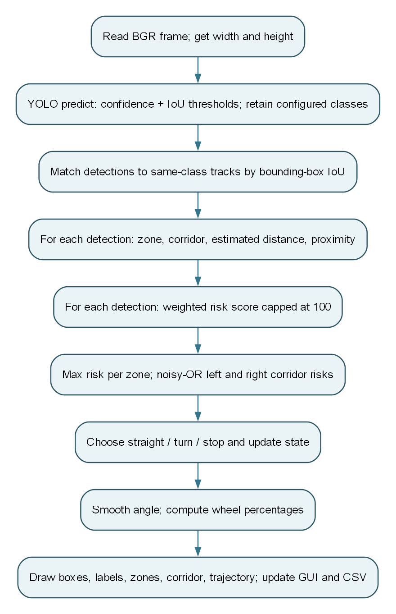
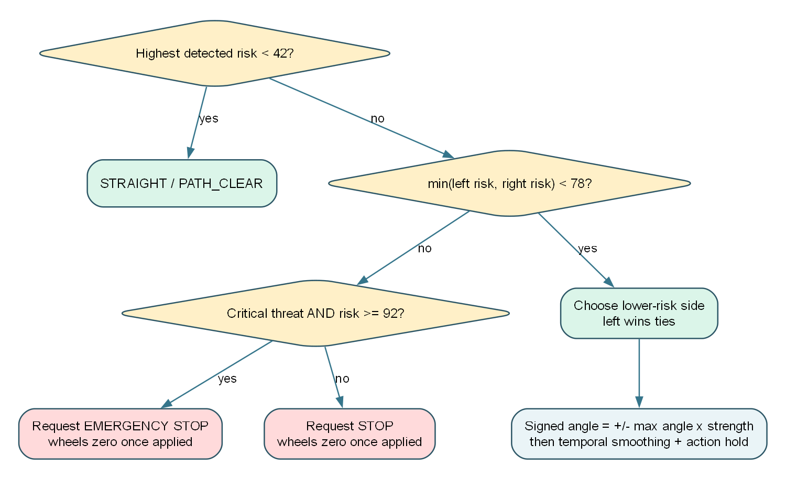
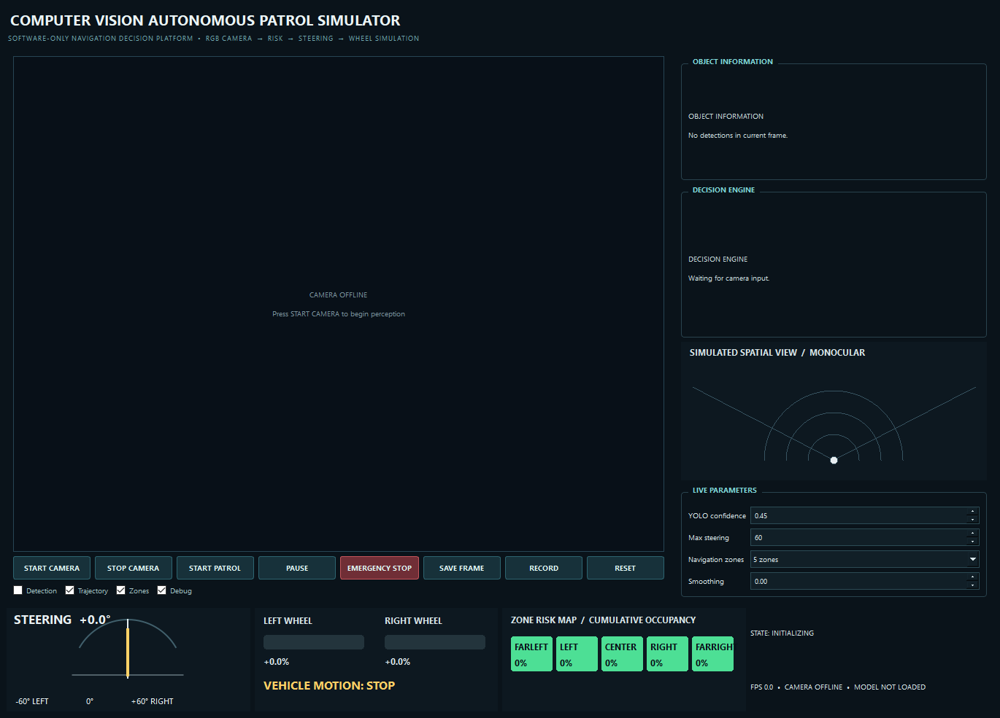
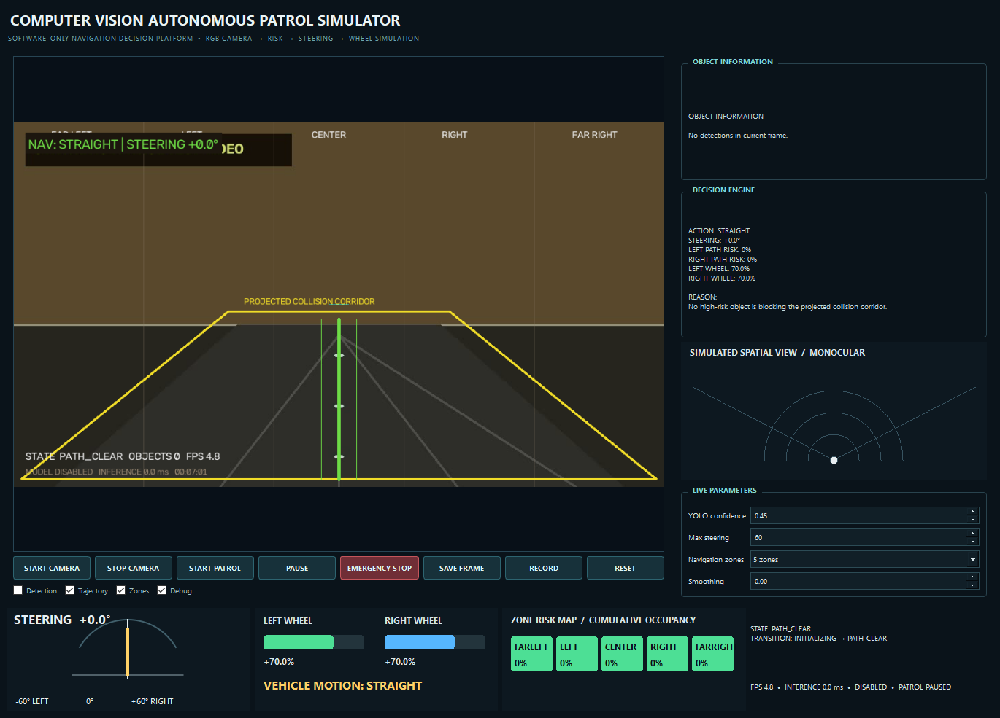
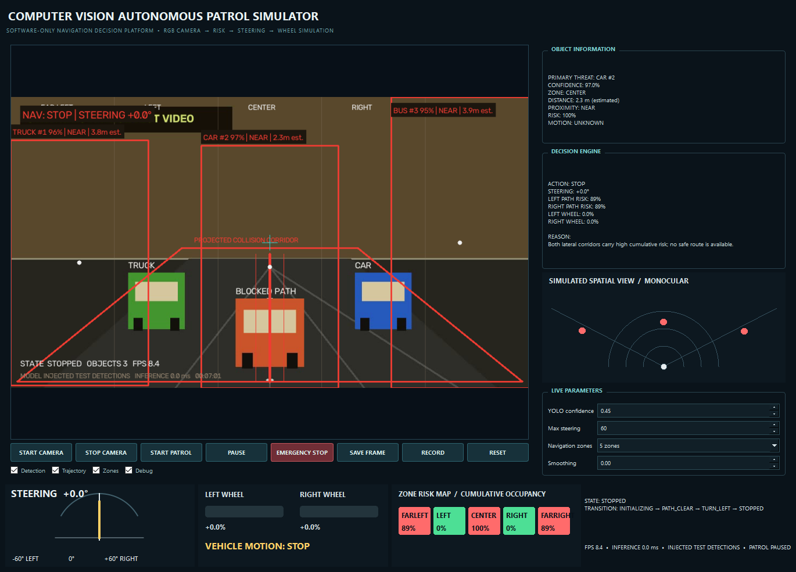

# Computer Vision Autonomous Patrol Simulator

**Engineering analysis and demonstration report**  
**Repository:** CV-Project  
**Reviewed:** 3 October 2026  
**Application type:** desktop, software-only navigation decision simulator

## Abstract

This project converts webcam or video frames into a simulated navigation decision. OpenCV captures frames; an optional Ultralytics YOLO11n model detects selected object classes; a small intersection-over-union (IoU) tracker assigns IDs; image-space geometry estimates zones, a projected corridor and approximate distance; a weighted risk model scores each detection; and a decision engine chooses straight motion, a turn, or a stop. A PySide6 dashboard shows the annotated video, reasons, steering angle, simulated wheel speeds, a zone risk map, and a monocular spatial view. The system writes detection-level CSV telemetry and can save annotated frames or recordings.

The application is an educational prototype. Its distances are estimates based on assumed object heights, its corridor is an image-space heuristic, and its wheel percentages are simulations. It has no motor interface or safety validation.

## 1. Objectives and scope

The main objective is to demonstrate a visible, explainable path from a camera frame to a navigation command. The implementation supports a webcam or MP4 input, optional object detection, configurable three- or five-zone analysis, risk aggregation across multiple objects, left/right route selection, steering smoothing, and a differential-drive display. A model-free mode lets the GUI and video path be checked without inference. Physical control, mapping, localization, depth sensing, and reliable free-space planning are outside the implemented scope.

## 2. Repository and dependencies

| Path | Responsibility |
|---|---|
| `main.py` | Command-line entry point; loads YAML and chooses webcam, video, or no-model mode. |
| `config.yaml`, `src/config.py` | Defaults and runtime configuration dataclasses. |
| `src/camera_manager.py` | OpenCV source opening, frame reads, and capture errors. |
| `src/object_detector.py`, `src/object_tracker.py` | YOLO adaptation, class filtering, greedy class-aware IoU tracks. |
| `src/zone_analyzer.py`, `src/distance_estimator.py` | Horizontal zone/corridor assignment and approximate monocular distance. |
| `src/risk_engine.py`, `src/occupancy_analyzer.py` | Object score and aggregate left/right corridor risk. |
| `src/decision_engine.py`, `src/steering_controller.py`, `src/wheel_controller.py` | Route choice, temporal angle smoothing, simulated wheel percentages. |
| `src/pipeline.py`, `src/models.py`, `src/state_machine.py` | Frame orchestration, typed records, visible state history. |
| `src/visualization.py`, `gui/` | OpenCV frame overlays and PySide6 dashboard widgets. |
| `src/logger.py` | CSV rows for detections and decisions. |
| `tools/create_sample_video.py`, `tests/test_navigation.py` | Synthetic MP4 fixture and six headless navigation tests. |
| `docs/capture_report_assets.py`, `docs/diagrams/` | Reproducible GUI captures and editable Graphviz flowcharts for this report. |

The declared packages are NumPy, OpenCV, PySide6, PyYAML, Ultralytics, python-docx, and pytest. Graphviz is required only to regenerate the flowchart images; it is not needed to run the app. The repository contains a `yolo11n.pt` file, and the configured model name is `yolo11n.pt`. The detector selects CUDA device `0` when PyTorch reports CUDA availability and `cpu` otherwise.

## 3. How to run

Run commands from the repository root. Python 3.11 or 3.12 is a conservative choice for dependency compatibility. On Windows PowerShell:

```powershell
python -m venv .venv
.venv\Scripts\Activate.ps1
python -m pip install --upgrade pip
python -m pip install -r requirements.txt
python main.py
```

`python main.py` opens the dashboard with the configured webcam (index 0); press **START CAMERA** to begin reading it. **START PATROL** changes the patrol indicator to active, but current code continues to compute decisions and wheel simulations even while that indicator reads paused. For repeatable video playback:

```powershell
python tools/create_sample_video.py
python main.py --video recordings/sample_patrol.mp4 --no-model
```

This MP4 tests playback and overlays. Its drawings are not real images of cars or people. With `--no-model`, the display should show no object boxes, the action should remain **STRAIGHT**, and wheel bars should show the base speed once frames are processing. To test actual detection, run `python main.py --video path\to\real_footage.mp4` or use a webcam with the model enabled. The input should contain one of the configured classes: person, bicycle, car, motorcycle, bus, truck, or chair. Model status and inference time appear in the bottom-right metrics line.

Other useful commands:

```powershell
python main.py --config config.yaml --video path\to\clip.mp4
python -m pytest -q
python docs/capture_report_assets.py
python docs/generate_report.py
```

The capture script creates the figure files in `docs/assets/`; the report script regenerates the Word document. On Linux, replace activation with `source .venv/bin/activate` and use a GUI-capable desktop session to run the application.

## 4. Architecture and frame flow


**Figure 1.** The complete software path. `NavigationPipeline.analyze` implements the center section and returns a `FrameAnalysis` object; `MainWindow.process_frame` obtains the input and handles display, recording, and logging.



**Figure 2.** Operations for one successful frame. The same thread performs frame capture, inference, risk analysis, and GUI update. Consequently, slow inference can make the interface less responsive, and the requested 33 ms timer interval is not a guaranteed 30 FPS output.

`CameraManager` returns a BGR NumPy image from OpenCV. `ObjectDetector` returns `Detection` records with class label, confidence, and `(x, y, width, height)` boxes. Subsequent modules mutate these records with track ID, zone, proximity, motion, and risk. `NavigationDecision` contains action, angle, reason, primary threat, corridor assessment, and state; `WheelCommand` contains left/right simulated percentages. The GUI and logger consume the aggregate `FrameAnalysis`.

## 5. Computer vision pipeline in detail

### 5.1 Capture and inference

For a webcam, OpenCV requests 1280 × 720 at 30 FPS; actual camera settings may differ. For a video, `cv2.VideoCapture` reads the supplied path. A failed open or exhausted stream produces a camera error in the view and stops the timer. When detection is enabled, `YOLO.predict` receives each BGR frame with default confidence `0.45`, IoU `0.45`, inference size `640`, and the selected device. Ultralytics applies its model's preprocessing and postprocessing, including suppression governed by the IoU setting. The adapter converts `xyxy` coordinates to integer `xywh` boxes and keeps only configured class names. A model-load failure changes status to **UNAVAILABLE - FALLBACK MODE**; an inference exception returns an empty detection list and stores an error string.

The `--no-model` option disables detection before GUI startup. In that mode the pipeline still renders zones, corridor, trajectory, status, and base wheel output, but it cannot recognize the objects depicted in a test video. The bundled synthetic MP4 produced zero YOLO detections at five sampled times (2, 6, 11, 16, and 21 seconds) in the reviewed environment, even with the model loaded. This is consistent with using simple drawings outside the model's normal image domain.

### 5.2 Tracking and apparent approach

`ObjectTracker` greedily matches each existing track to the highest-IoU unmatched detection with the same class. The required IoU is `0.25`. Unmatched detections receive increasing IDs; a missing track is deleted after more than 12 missed frames. IoU is intersection area divided by union area. Each track keeps up to eight bounding-box areas; after at least three observations, a change greater than `+8%` from the oldest stored area is labeled **APPROACHING**, below `−8%` is **MOVING AWAY**, and the interval between is **STATIONARY**. This is apparent image-size change, not measured 3D velocity. Greedy association can swap IDs in crowded or occluded scenes.

### 5.3 Zones and projected corridor

With five zones, the image is split evenly by the horizontal center of a detection box: `[0, 20%)` far left, `[20, 40%)` left, `[40, 60%)` center, `[60, 80%)` right, and `[80, 100%]` far right. Three-zone mode similarly divides width into thirds. The analysis corridor flags an object when its box center lies in the central 34% of image width and below 52% of image height. This is an image-space test. The displayed yellow/red trapezoid suggests a perspective path, but `ZoneAnalyzer` uses a rectangular center test rather than that trapezoid. The `collision_corridor_bottom` setting is declared but not read by this analysis.

### 5.4 Monocular distance and proximity

For a bounding-box height `h_px`, the estimate is `distance_m = focal_length_px × assumed_height_m / h_px`. The default focal length is 700 pixels. Class height priors range from 1.0 m for a chair to 3.0 m for a bus; a car uses 1.45 m and a person 1.70 m. Values are clamped to 0.2–30 m and rounded to 0.1 m. For example, a 145-pixel-high car gives `700 × 1.45 / 145 = 7.0 m`. The default bands are **CRITICAL** below 2 m, **NEAR** from 2 to less than 4 m, **CAUTION** from 4 to less than 6 m, and **SAFE** from 6 m upward. These are rule-based labels on an uncalibrated estimate. Occlusion, pose, partial boxes, image resizing, perspective, or an unusual object size can change the result substantially.

### 5.5 Detection risk and scene occupancy

Each object receives a score from proximity, box size, vertical position, corridor membership, class, confidence, and approach label. The source formula is:

```text
P = {SAFE:8, CAUTION:28, NEAR:62, CRITICAL:90}
S = min(100, bbox_area / frame_area × 850)
V = clamp(100 × bbox_bottom / frame_height, 0, 100)
L = 26 if the detection center is in the analysis corridor, else 7
T = {person:12, bicycle:10, motorcycle:10, car:10, truck:12, bus:12, chair:4}
A = 14 if the track is labelled APPROACHING, else 0
risk = min(100, 0.46P + 0.20S + 0.12V + L + T + 10 × confidence + A)
```

`RiskEngine` rounds the result to one decimal place. The class weights and coefficients are manually chosen; the score is an ordering signal, not a calibrated collision probability. **SAFE** proximity therefore does not guarantee a low total risk: a large lower-frame box in the corridor can still exceed the navigation threshold. Each zone takes the maximum risk of its objects. For the left and right groups, `OccupancyAnalyzer` computes `100 × (1 − ∏(1 − zone_risk/100))` (a noisy-OR). This makes two moderately occupied lanes jointly riskier. In five-zone mode, left is far-left plus left, right is right plus far-right; the center zone is tracked separately. Equal side scores select left.

### 5.6 Decisions, steering, and wheel values



**Figure 3.** Implemented decision path under the default thresholds. The primary threat is the highest-scoring object. If no object reaches risk `42`, the action is **STRAIGHT** and state is **PATH_CLEAR**. Otherwise the engine turns toward the lower-risk side if its aggregate risk is below `78`; if both sides are at least `78`, it stops. A stop becomes **EMERGENCY STOP** only when the primary threat is **CRITICAL** and has risk at least `92`. The decision engine calculates a `center_blocked` flag but does not use it to gate turns: a high-risk side object can also cause a turn.

For a turn, the requested magnitude is `max_angle × min(1, max(0.2, threat_risk / 100))`, with a floor of 0.88 for a critical threat. Negative means left and positive means right. `SteeringController` then applies `new_angle = old_angle × smoothing + requested_angle × (1 − smoothing)`; the default smoothing is `0.72`. Action changes are held for at least `0.35` seconds, including requested stops. The angle is clamped to the configured maximum, default 60°. The wheel simulator uses a base of 70%, slows the inside wheel by up to 86% of that base, raises the outside wheel by up to 15%, and caps the values. Both become zero when the applied action is **STOP** or **EMERGENCY STOP**. These numbers are display commands, not calibrated vehicle speeds.

## 6. Dashboard and controls



**Figure 4.** Actual PySide6 window captured before camera start. The large left panel is the annotated camera view. The right column contains object details, decision explanation, simulated spatial view, and live parameters. The bottom row contains steering, left/right wheel bars, per-zone risk, state history, FPS, model status, and patrol indicator.

| Control | Observed behavior |
|---|---|
| **START CAMERA** | Opens webcam or configured video and starts the frame timer. |
| **STOP CAMERA** | Stops the timer, releases capture, ends recording, and updates status. |
| **START PATROL** | Sets the patrol indicator active and clears a manual emergency flag. |
| **PAUSE** | Changes the patrol indicator to paused; perception and simulated wheel computation continue. |
| **EMERGENCY STOP** | Overrides the current displayed action and wheel output to zero on subsequent frames until reset or patrol start. |
| **SAVE FRAME** | Writes the most recent annotated camera frame to `screenshots/patrol_<timestamp>.png`; it does not capture the whole dashboard. |
| **RECORD / STOP REC** | Starts or ends an MP4 of the annotated camera frame in `recordings/`. |
| **RESET** | Clears manual emergency/patrol flags and steering memory, and sets internal state to `SEARCHING`. |
| **Detection** | Enables/disables calls to an already-loaded detector. If the app started with `--no-model`, ticking it cannot load the missing model dynamically. |
| **Trajectory / Zones / Debug** | Show or hide the corresponding frame overlays. |
| **YOLO confidence / Max steering / Navigation zones / Smoothing** | Update these in-memory settings live; changes are not written back to `config.yaml`. |

The UI's spatial view is drawn from assigned zones and estimated distances. It is not a radar sensor reading. The displayed corridor and curved trajectory are OpenCV overlays in the camera image; `TrajectoryGenerator` exists in `src/` but the active overlay uses a separate `_trajectory` method in `FrameVisualizer`.

## 7. Demonstrated outcomes and figure provenance

The following images are **screenshots of the real Qt application**, captured by `docs/capture_report_assets.py` using the included synthetic video. The clear scene runs with detection disabled. For the turn and stop scenes, the capture script injects known `Detection` boxes into the normal tracker → geometry → risk → decision → GUI path. They demonstrate control logic and visualization; they are **not** evidence that YOLO recognized the synthetic drawings. Those two screenshots show model status **INJECTED TEST DETECTIONS** as an additional cue. For reproducible captures, the script sets smoothing and minimum command duration to zero; the normal defaults are 0.72 and 0.35 s.



**Figure 5. Clear path.** No boxes are supplied. The app renders zones and corridor, chooses **STRAIGHT**, and shows equal simulated wheel values. This matches the no-model playback behavior.


**Figure 6. Lower-risk left route.** A center car and a right-side person are supplied as test detections. The right corridor carries more aggregate risk, so the decision is **TURN LEFT**; the left wheel bar is shorter than the right. The box labels show ID, class, confidence, proximity, and estimated distance.



**Figure 7. Both sides blocked.** A high-risk truck in the far-left zone, a car in the center, and a bus in the far-right zone push both lateral risks above the default stop threshold. The action is **STOP**, the trajectory/corridor turns red, and both simulated wheel values are zero. The highest-scoring car is **NEAR**, so this is a normal stop rather than the stricter critical-threat emergency branch.

## 8. Logging, tests, and observed validation

If enabled, `DecisionLogger` appends `logs/navigation_events.csv` with timestamp, object ID/class, confidence, box, zone, estimated distance, risk, navigation state, angle, left/right wheel values, and action. It writes one row **per detection**, so a clear frame produces no CSV row. Screenshot and recording filenames include a local timestamp. The report captures are stored in `docs/assets/` rather than the normal runtime `screenshots/` folder.

On the reviewed Windows environment, the system Python had OpenCV, PySide6, Ultralytics, python-docx, and pytest installed. `python -m pytest -q` passed all **6** tests. The installed YOLO model loaded with `READY (cpu)`. Sampling the synthetic video at five times produced **0** detections; the injected screenshot cases exercised the remaining navigation path. No measured real-footage accuracy, FPS benchmark, confusion matrix, or physical driving outcome is claimed. The project's `venv/` folder present in the workspace did not contain OpenCV or pytest, so the report was generated with the system Python; a newly created environment installed from `requirements.txt` is the reproducible setup.

The automated tests cover empty-scene straight motion, turning toward a lower-risk left side, fully blocked corridors and emergency classification, zone-boundary assignment, differential-drive sign convention, and angle clamping. They do not currently test YOLO integration, Qt controls, the CSV logger, capture errors, tracking over time, distance calibration, or the manual emergency state display.

## 9. Limitations and code review observations

1. **Distance is uncalibrated.** The pinhole estimate assumes class height and a fixed focal length; it should be read as a rough visual cue.
2. **The corridor analysis differs from the drawn trapezoid.** Risk uses a central rectangle and the box center. A box touching the visual trapezoid may be treated as outside the analysis corridor.
3. **Patrol and pause are UI flags.** `start_patrol` and `pause_patrol` do not gate `NavigationPipeline.analyze` or zero its simulated wheels.
4. **Manual emergency does not update the navigation state machine.** The GUI overrides action, angle, and wheels after pipeline analysis, so the state and transition text can still show a previous state, and the decision reason is not replaced.
5. **The on-screen corridor uses fixed geometry.** `FrameVisualizer` hard-codes 34% width and 52% top, so changing related configuration would leave the overlay out of sync with analysis. The `collision_corridor_bottom` and `steering.sensitivity` settings are defined but unused.
6. **No explicit clear-path speed reduction is implemented.** The `SLOW_DOWN`, `FOLLOWING_PATH`, and `ANALYZING_OBSTACLE` enum values exist, but the current decision engine returns mainly `PATH_CLEAR`, `TURN_LEFT`, `TURN_RIGHT`, `STOPPED`, or `EMERGENCY_STOP`.
7. **Detection failures resemble clear scenes.** The detector returns an empty list after an inference exception; the decision then becomes **STRAIGHT**. The model status may still show ready while `last_error` is not shown on the dashboard.
8. **Inference runs on the GUI timer callback.** A slow model can stall the dashboard. A capture/inference worker and explicit frame dropping would improve responsiveness.
9. **Requested stops can be delayed by action hysteresis.** The 0.35 s minimum command duration also applies to **STOP** and **EMERGENCY STOP** from the decision engine; simulated wheels are zeroed only after the applied action changes. The manual emergency button overrides wheels on the next processed frame.
10. **Tracking is simple.** Greedy IoU association and bounding-box area trends are useful for demonstrations but fragile under occlusion, camera motion, and close object crossings.

These observations are based on the reviewed source, not claims about a deployed autonomous platform. Practical next steps are to test with labeled real footage, calibrate the camera and object-size assumptions, make the drawn and computed corridor share one geometry source, make pause/emergency state consistent, expose inference errors, and move inference off the UI thread.

## 10. Reproducibility and source references

To regenerate the figures, run `python docs/capture_report_assets.py`. It creates the 24-second video and captures the Qt dashboard. Graphviz diagram sources are in `docs/diagrams/*.dot`; regenerate a PNG with `dot -Tpng -Gdpi=180 docs/diagrams/system_flow.dot -o docs/assets/system_flow.png` and similarly for the other two files. `python docs/generate_report.py` creates the formatted Word copy at the repository root.

This analysis derives from the local source files cited in Section 2. The default numeric settings come from `config.yaml`; algorithm formulas come from `src/distance_estimator.py`, `src/risk_engine.py`, `src/occupancy_analyzer.py`, `src/decision_engine.py`, `src/steering_controller.py`, and `src/wheel_controller.py`. Screenshots are original captures from the repository's own GUI, with injected scenario data disclosed above.
